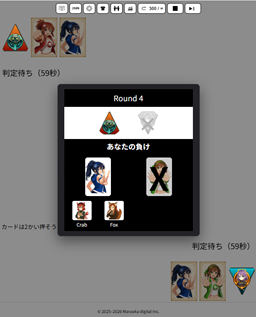

# 前出しじゃんけん (Maedashi Janken)

「前出しじゃんけん」の公開仕様リポジトリです。

このリポジトリでは、ゲームルール・API仕様・スキン仕様など、  
「前出しじゃんけん」に関わる公開仕様をまとめて公開しています。

---

## はじめての方へ

目的に応じて以下のドキュメントからご覧ください。

- ゲーム概要を知りたい場合  
  → [docs/overview.md](docs/overview.md)

- ゲームルールを確認したい場合  
  → [docs/rulebook.md](docs/rulebook.md)

- Advice API を利用したい場合  
  → [docs/advice-api/advice-api-spec.md](docs/advice-api/advice-api-spec.md)

---

## Documentation

公開ドキュメントは `docs/` にまとまっています。

- 全体概要  
  → [docs/overview.md](docs/overview.md)

- ゲームルール  
  → [docs/rulebook.md](docs/rulebook.md)

- ドキュメント一覧  
  → [docs/README.md](docs/README.md)

- Advice API  
  外部AIや外部プログラムからゲームに参加するためのインターフェース仕様  
  → [docs/advice-api/README.md](docs/advice-api/README.md)

- スキンパッケージ  
  スキン ZIP の構成、manifest、画像スロット、背景設定の仕様  
  → [docs/skin-package-guide.md](docs/skin-package-guide.md)

- パターン JSON  
  手札パターンの JSON 定義フォーマットと記述ルール  
  → [docs/pattern-json-guide.md](docs/pattern-json-guide.md)

---

## Screenshots

以下はゲームの流れを示す画面例です。

### 勝負フェーズの画面例（手札が公開されている状態）


### 勝利条件を選択する画面


### ラウンドの結果表示画面


---

## Repository Structure

```
maedashi-janken/
├── docs/
│   ├── overview.md
│   ├── rulebook.md
│   ├── README.md
│   ├── pattern-json-guide.md
│   ├── skin-package-guide.md
│   └── advice-api/
└── public/
    └── images/
        └── public-screenshots/
```

---

## Roadmap

今後、以下を順次追加予定です。

- Advice API の実装例（複数言語）
- スキンのサンプルパッケージ
- 教材用の最小構成コード
- チュートリアル

---

## License

このリポジトリの内容は LICENSE に従います。

※コード・ドキュメント・画像で扱いが異なる場合があります。
