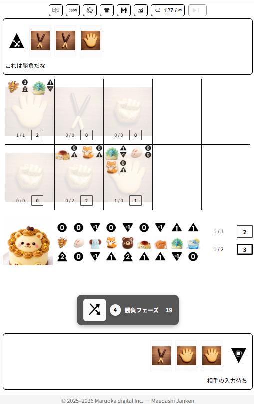
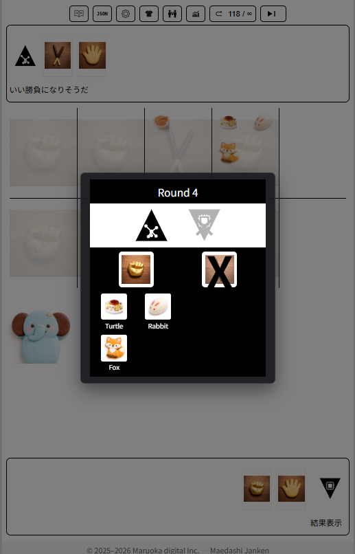

# 前出しじゃんけん (Maedashi Janken)

手札が見える対戦ゲーム「前出しじゃんけん」の公開リポジトリです。

このリポジトリでは、主に以下を公開しています。

- Advice API（外部AI連携用インターフェース）
- 教材として利用可能なドキュメント

現時点では、**仕様ドキュメントを中心に先行公開**しています。  
ゲーム本体や教材用コードは、今後段階的に整理・公開していきます。

---

## Screenshot

### Game screen


### Battle / UI example


---

## Documentation

ドキュメントは `docs/` にまとまっています。

- Advice API  
  外部AIと連携するためのインターフェース仕様  
  → [docs/advice-api/](docs/advice-api/)

---

## Getting Started

このリポジトリ単体でゲームを起動することは想定していません。  
まずは以下のドキュメントから仕様を確認してください。

- Advice API を使いたい場合  
  → [docs/advice-api/advice-api-spec.md](docs/advice-api/advice-api-spec.md)

---

## Repository Structure

```
public-release/
docs/ 仕様ドキュメント
public/ 画像・スクリーンショット
```

---

## Roadmap

今後、以下を順次追加予定です。

- Advice API の実装例（複数言語）
- スキンのテンプレート
- 教材用の最小構成コード
- チュートリアル

---

## License

このリポジトリの内容は LICENSE に従います。

※コード・ドキュメント・画像で扱いが異なる場合があります。
