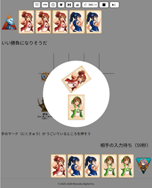
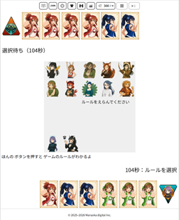

# 前出しじゃんけん (Maedashi Janken)

手札が見える対戦ゲーム「前出しじゃんけん」の公開リポジトリです。

このリポジトリでは、主に以下を公開しています。

- Advice API（外部AI連携用インターフェース）
- スキン仕様（画像差し替え・背景設定用）
- 公開向けドキュメント

現時点では、**公開仕様ドキュメントを中心に整理・公開**しています。  
ゲーム本体や教材用コードは、今後段階的に整理・公開していきます。

---

## Screenshot

### Game screen


### Battle / UI example


---

## Documentation

公開ドキュメントは `docs/` にまとまっています。

- 全体概要  
  → [docs/overview.md](docs/overview.md)

- ゲームルール  
  → [docs/rulebook.md](docs/rulebook.md)

- ドキュメント一覧  
  → [docs/README.md](docs/README.md)

- Advice API  
  外部AIや外部プログラムからゲームに参加するためのインターフェース仕様  
  → [docs/advice-api/README.md](docs/advice-api/README.md)

- スキンパッケージ  
  スキン ZIP の構成、manifest、画像スロット、背景設定の仕様  
  → [docs/skin-package-guide.md](docs/skin-package-guide.md)

- パターン JSON  
  手札パターンの JSON 定義フォーマットと記述ルール  
  → [docs/pattern-json-guide.md](docs/pattern-json-guide.md)

---

## Getting Started

このリポジトリ単体でゲームを起動することは想定していません。  
まずは目的に応じて以下から確認してください。

- 前出しじゃんけんがどんなゲームか知りたい場合  
  → [docs/overview.md](docs/overview.md)

- Advice API を使いたい場合  
  → [docs/advice-api/advice-api-spec.md](docs/advice-api/advice-api-spec.md)

- スキンを作りたい場合  
  → [docs/skin-package-guide.md](docs/skin-package-guide.md)

---

## Repository Structure

```
maedashi-janken/
├── docs/
│   ├── overview.md
│   ├── rulebook.md
│   ├── README.md
│   ├── pattern-json-guide.md
│   ├── skin-package-guide.md
│   └── advice-api/
└── public/
    └── images/
        └── public-screenshots/
```

---

## Roadmap

今後、以下を順次追加予定です。

- Advice API の実装例（複数言語）
- スキンのサンプルパッケージ
- 教材用の最小構成コード
- チュートリアル

---

## License

このリポジトリの内容は LICENSE に従います。

※コード・ドキュメント・画像で扱いが異なる場合があります。
